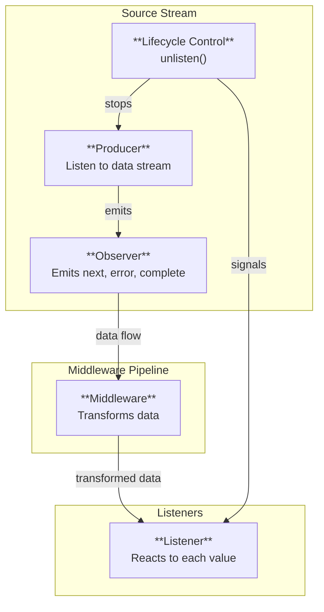

## Stream Emitter

### Reactive programming with Node.js's EventEmitter

#### Event-driven middleware for effective & clear  

<br>

**Inspired from RxJS**    
This is **NOT FOR PRODUCTION**  
Currently focused on features, so this is not a library at all  

<br>


## Features

```typescript
import { EmitStream } from "@emiter/emit-stream";
import { useAsyncMiddleware, useMiddleware } from "@middleware/use-middleware";

const stream = new EmitStream<number>(
  (observer) => {
    let count = 0;
    const id = setInterval(() => observer.next(count++), 100);

    return () => clearInterval(id);
  },
  {
    maxBufferSize: 3,
    continueOnError: true,
  }
);

const dualMw = useMiddleware(
  (v: number) => (Math.random() > 0.5 ? Promise.resolve(v + 1) : v + 1),
  {
    retries: 2,
    retryDelay: 50,
    continueOnError: true,
  }
);

const asyncMw = useAsyncMiddleware(
  async (v: number) => {
    if (Math.random() > 0.7) throw new Error("Async error");
    return `${v} processed`;
  },
  {
    retries: 2,
    retryDelay: 50,
    maxRetryDelay: 500,
    jitter: 0.2,
    delayFn: (attempt, delay) => delay * (attempt + 1),
    continueOnError: true,
  }
);

const syncStream = stream.use(dualMw);
syncStream.listen({
  next: (v) => console.log(`Sync: ${v}`),
  error: (e) => console.error(`Sync error: ${e}`),
});

stream.asyncUse(asyncMw).then((asyncStream) => {
  asyncStream.listen({
    next: (v) => console.log(`Async: ${v}`),
    error: (e) => console.error(`Async error: ${e}`),
    complete: () => console.log("Async completed"),
  });
  setTimeout(() => asyncStream.pause(), 300);
  setTimeout(() => asyncStream.resume(), 600);
});

setTimeout(() => stream.unlisten('complete'), 1000);

```

## Architecture

### **Source Stream**
1. **Controls data flow**: Generate data via its producer and emits event to drive the pipeline  
2. **Manages lifecycle**: Starts / stops the stream

### **Middleware**
1. **Transforms data**: Applies transformations to values as they flow from the source through the pipeline  
2. **Chains streams**: Creates new `EmitStream` instances that listen to the previous stream, forming a transformation chain

### **Listener**
1. **Reacts to data in real-time**: Called **every time a value flows through the stream** it's attached to
2. **Handles lifecycle events**: Also reacts to `error` or `complete` when the stream terminates

<br>



