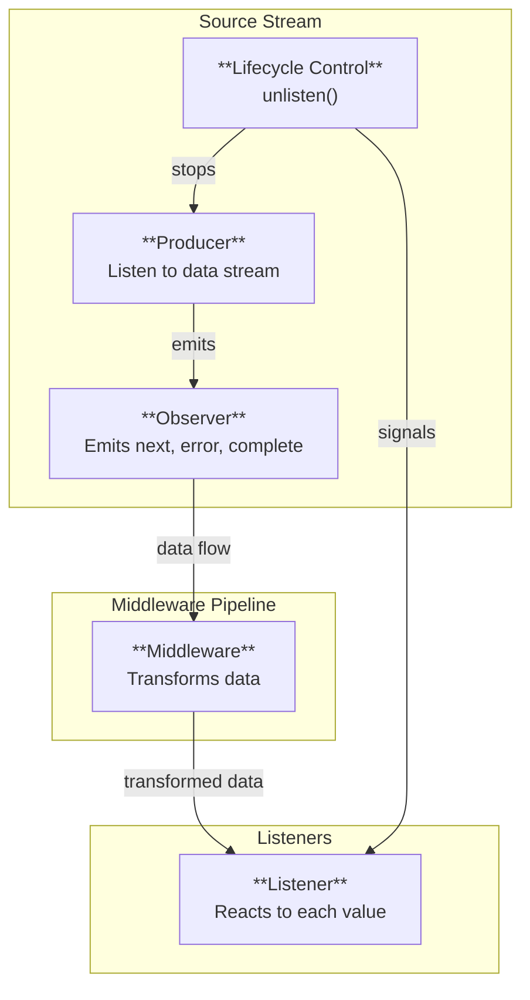

## Stream Emitter

#### Event-driven middleware for effective & clear  

<br>

**Inspired from RxJS**    
This is **NOT FOR PRODUCTION**  
Currently focused on features, so this is not a library at all  

<br>


## Features

```typescript
import { EmitStream } from "@emiter/emit-stream";

const stream = new EmitStream<number>((observer) => {
  let i = 0;
  const id = setInterval(() => observer.next(i++), 100);
  return () => clearInterval(id);
}, { maxBufferSize: 3 });

stream.use(
  [(v: number) => v + 1, (v: number) => Promise.resolve(v + 2)],
  { retries: 2, retryDelay: 50 }
).listen({
  next: (v) => console.log(v),
  error: (e) => console.error(e),
});


```

## Architecture

### **Source Stream**
1. **Controls data flow**: Generate data via its producer and emits event to drive the pipeline  
2. **Manages lifecycle**: Starts / stops the stream

### **Middleware**
1. **Transforms data**: Applies transformations to values as they flow from the source through the pipeline  

### **Listener**
1. **Reacts to data in real-time**: Called **every time a value flows through the stream** it's attached to
2. **Handles lifecycle events**: Also reacts to `error` or `complete` when the stream terminates

<br>




<br>


## Performance

event amount: 1,000,000,000

EmitStream - Simple Emission: 921,563 ops/sec ±3.54% (88 runs sampled)
EmitStream - Transformation: 489,946 ops/sec ±2.38% (82 runs sampled)
RxJS - Simple Emission: 993,289 ops/sec ±3.43% (82 runs sampled)
RxJS - Transformation: 602,430 ops/sec ±3.13% (84 runs sampled)


